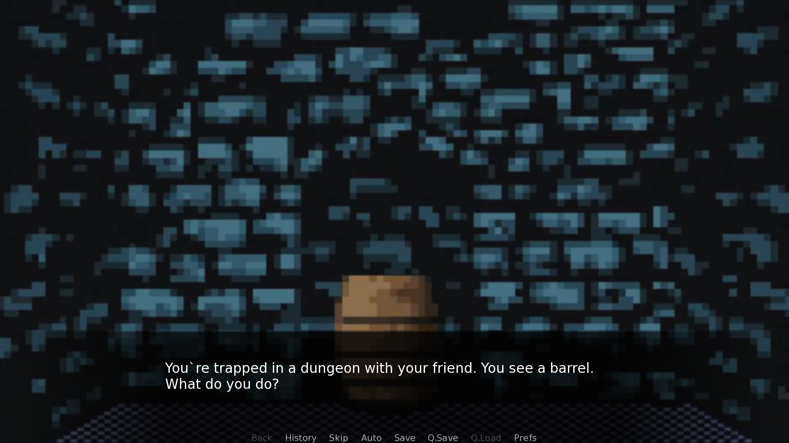
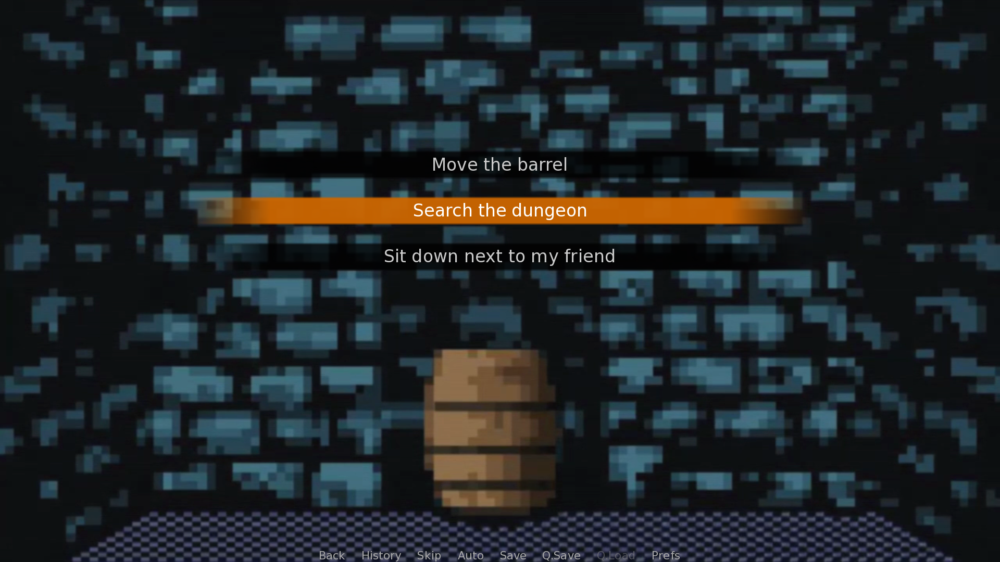
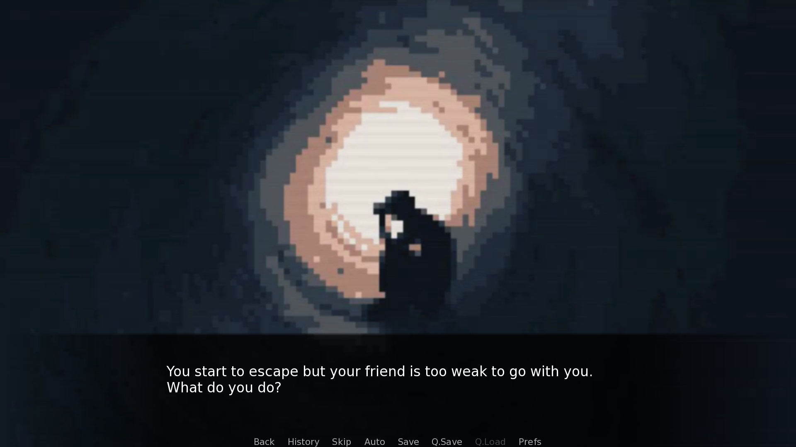

# eXit: The Digital Escape

eXit: The Digital Escape, A Visual Novel game based on Mr. Robot Season 4 Episode 11

To download the game, please follow the link below:

https://drive.google.com/drive/folders/1N9h3EnhfOAzPd3asaoOlNO4MVTEa507A?usp=sharing

Click on the link to access the Google Drive folder where you can download the game files.

After downloading the game files from the Google Drive link, follow the installation instructions based on your operating system:
Windows

1.  Extract the downloaded ZIP file to a location of your choice.
2.  Navigate to the extracted folder.
3.  Double-click on the eXit.exe file to launch the game.

# Images

  
  
  
